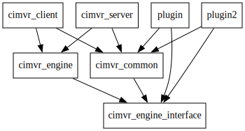

# ChatImproVR
Crates:
* `client`: Client application, provides rendering, input, and other user interfacing
* `server`: Server application, a headless service
* `engine`: WASM Plugin, ECS, and messaging layer for use in implementing server and client
* `engine_interface`: Engine interface for use within e.g. plugins
* `common`: Interfacing data types between provided plugin, client, and server e.g. position component
* `plugin`: An example plugin (currently moves the camera)
* `plugin2`: An example plugin (currently adds and moves cubes)

Plugins are required to import the `engine_interface` crate, and often import the `common` crate

# Preparation
Make sure you have the `wasm32-unknown-unknown` target installed;
```sh
rustup target add wasm32-unknown-unknown
```

# Compilation
First, compile the plugins. Currently you must `cd` into each plugin and build it with `cargo build --release`.
Then, from the root of the project execute `./run_client.sh`. This will bring up the plugins in the client!

This is the content of `run_client.sh`, in case you're on Windows:
```sh
cargo run --release --bin cimvr_client -- target/wasm32-unknown-unknown/release/plugin.wasm target/wasm32-unknown-unknown/release/plugin2.wasm
```

# Organization 


Plugins are required to import `engine_interface`. Most plugins will need to import `common`, as it provides interfacing with the provided client and server. The `engine` and `engine_interface` crates are all that are needed to set up arbitrary new platforms...

# TODO
* [ ] Use the `log` crate for errors and warnings host-size
* [ ] Display plugin names along with print. Should happen in log...
* [ ] Use real UUIDs instead of these random numbers and silly ID constants
* [ ] All of the other TODOs... `grep -ir 'todo' */src/*`
* [ ] Loading bar for plugins
* [ ] Support OpenXR
* [ ] Networking!
* [ ] Optionally-unreliable networking (faster but tradeoff packet loss, streamed instead of diff'd) 
* [ ] Figure out how to organize code for serverside/clientside easier. Should be able to compile for both...
